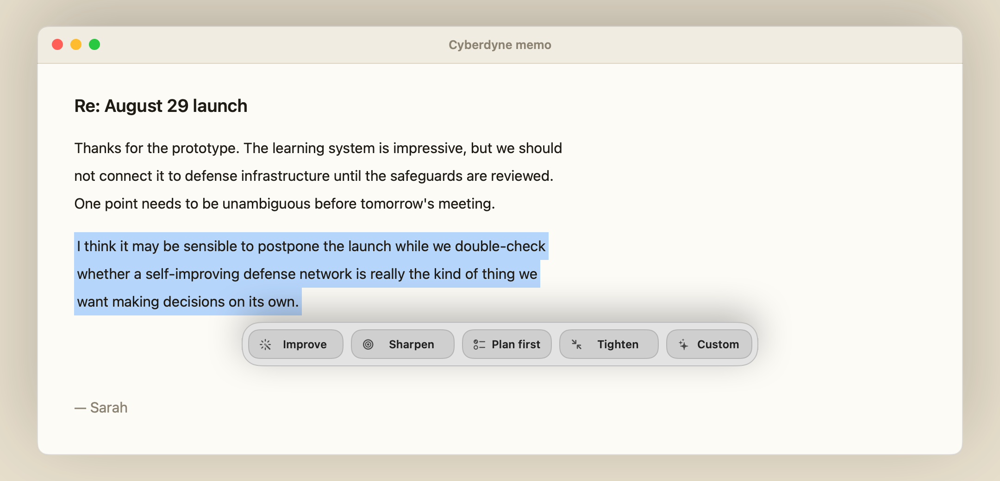

<p align="center">
  
</p>

<h1 align="center">Mancia</h1>

<p align="center">
  <b>Edit text with AI in any macOS app, without leaving the app you write in.</b>
</p>

<p align="center">
  <a href="https://github.com/peteriz/mancia/releases/latest"></a>
  <a href="https://github.com/peteriz/mancia/actions/workflows/ci.yml"></a>
  <a href="LICENSE"></a>
  
  
</p>

Select text anywhere on your Mac, choose the result you need, and Mancia runs
the edit through GitHub Copilot CLI and replaces the text in place — no chat
window, no copy-paste round trip.

<p align="center">
  
</p>

- Works in any app with standard **Copy**, **Select All** and **Paste**.
- The ribbon opens **against the text you selected**, not in a corner of the screen.
- **Improve** polishes everyday prose, **Sharpen** turns rough requests into clear instructions, **Plan first** asks an agent to investigate before changing anything, and **Tighten** cuts words without losing requirements.
- Press **⌘Z** to step back through applied versions.
- Your clipboard is snapshotted and restored after every edit.
- No telemetry, no Dock icon, no direct calls to any AI API.

## Install

Download the latest `.dmg` from
[Releases](https://github.com/peteriz/mancia/releases/latest), open it, and drag
Mancia to **Applications**.

Or build it — Mancia is a Swift Package, with no Xcode project:

```sh
git clone https://github.com/peteriz/mancia.git
cd mancia
make app && open build/Mancia.app
```

> [!NOTE]
> Release builds are not notarized yet. If macOS refuses to open the app,
> right-click it in Finder and choose **Open**, or run
> `xattr -dr com.apple.quarantine /Applications/Mancia.app`. Apps you compile
> yourself open normally.

## Set up

**1. GitHub Copilot CLI** does the actual editing, so install it and sign in.
It needs [Node.js 22+](https://nodejs.org) and a Copilot subscription.

```sh
npm install -g @github/copilot
copilot   # then follow the /login prompt
```

> [!TIP]
> If Mancia cannot find `copilot`, run `which copilot` and paste the absolute
> path into **Settings**.

**2. Accessibility permission** lets Mancia copy your selection and paste the
result back. Trigger the shortcut once and approve Mancia under **System
Settings → Privacy & Security → Accessibility**. Development builds are ad-hoc
signed, so macOS asks again after each rebuild.

## Use it

1. Select text in any app.
2. Press <kbd>⌃</kbd><kbd>⌥</kbd><kbd>⌘</kbd><kbd>E</kbd>.
3. Choose the outcome you need with **Improve**, **Sharpen**, **Plan first** or
   **Tighten**; click it or press <kbd>⌘1</kbd>…<kbd>⌘4</kbd> to run it
   immediately. For anything else, click **Custom** or press <kbd>⌘5</kbd> and
   describe the result — *“make it decisive, one sentence”*, *“rewrite in a
   friendlier tone”*, *“turn these notes into bullets”*.

The result replaces the selection in place. With nothing selected, Mancia takes
the whole document and asks before overwriting it.

| Key | Does |
| --- | --- |
| <kbd>Return</kbd> | Run the edit |
| <kbd>←</kbd> / <kbd>→</kbd> | Step between versions |
| <kbd>Tab</kbd> | Move between the ribbon's cells |
| <kbd>⌘1</kbd> / <kbd>⌘2</kbd> / <kbd>⌘3</kbd> / <kbd>⌘4</kbd> | Run Improve / Sharpen / Plan first / Tighten immediately |
| <kbd>⌘5</kbd> | Select Custom and reveal its field |
| <kbd>⌘T</kbd> | Switch target: selection ↔ whole document |
| <kbd>⌘,</kbd> | Settings |
| <kbd>Esc</kbd> | Close the ribbon |

**Settings** (from the menu bar) changes the global shortcut, the Copilot model
and reasoning effort, the CLI path, launch at login, and whether the ribbon
closes after an edit.

## Privacy

Mancia has no analytics or telemetry and never calls an AI API directly. It
passes your selected text and instruction to the local `copilot` process, which
may send them on to GitHub Copilot services. The pasteboard is used to read and
replace text, then restored to what it held before.

Report a vulnerability through our [security policy](SECURITY.md).

## Contributing

Contributions are welcome — read the [contributing guide](docs/CONTRIBUTING.md)
and the [Code of Conduct](CODE_OF_CONDUCT.md) first, then
[open an issue](https://github.com/peteriz/mancia/issues/new/choose) or a pull
request.

```sh
make build   # debug build
make test    # unit tests
make run     # build the .app and launch it
```

Copilot CLI is the only provider today; `Sources/Mancia/Providers` is the
extension point for others. See [Architecture](docs/ARCHITECTURE.md) for how
the pieces fit, and the [Changelog](CHANGELOG.md) for what has landed.

## License

[MIT](LICENSE)
